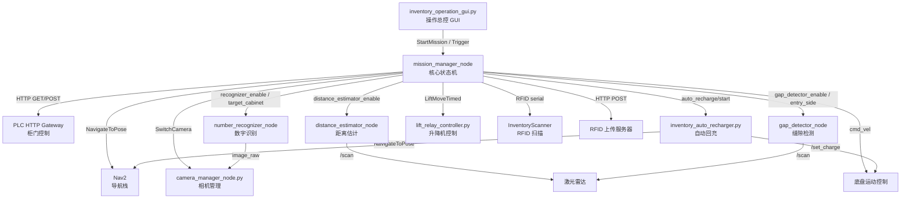
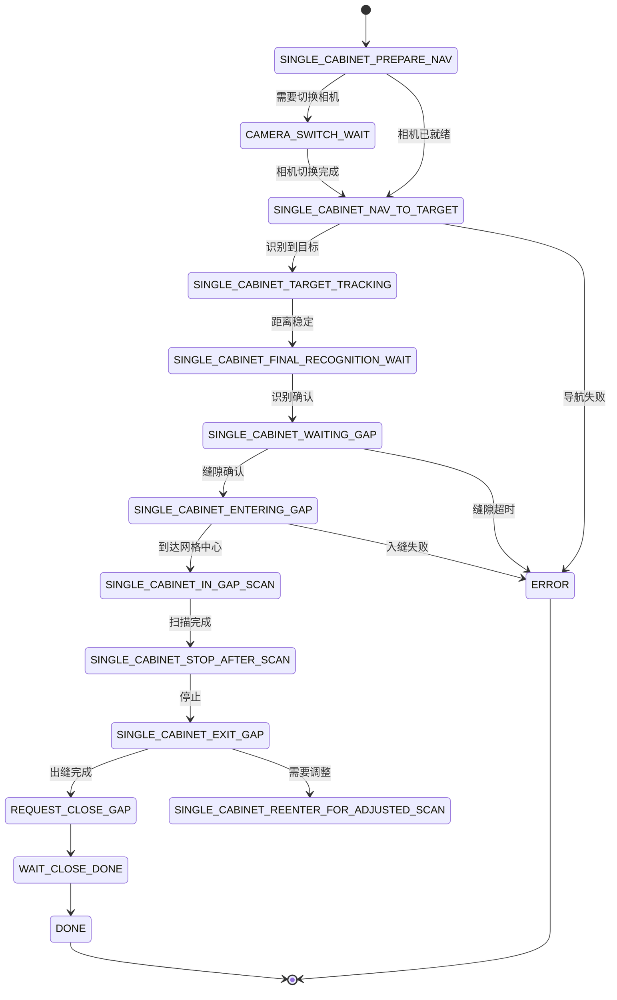
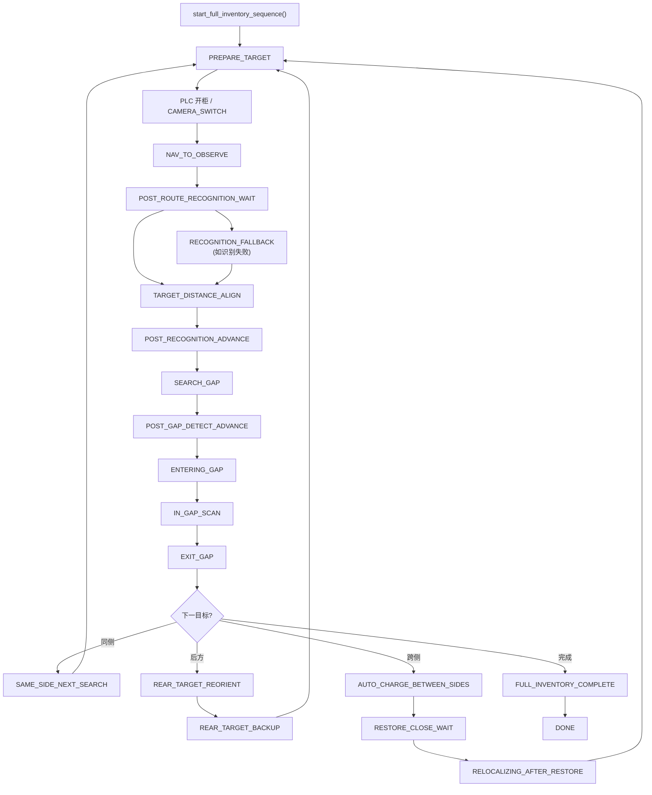

# AGV 盘库系统 — 状态机设计、参数块与代码文档分析

> 生成日期：2026-06-20
> 项目包名：agv_inventory_system
> 版本：0.0.2
> 运行环境：ROS2 Humble / Ubuntu 22.04

---

## 目录

1. [项目总体说明](#1-项目总体说明)
2. [代码目录和模块职责说明](#2-代码目录和模块职责说明)
3. [ROS2 接口文档](#3-ros2-接口文档)
4. [mission_manager 状态机设计详解](#4-mission_manager-状态机设计详解)
5. [参数块详细说明](#5-参数块详细说明)
6. [参数依赖关系和风险分析](#6-参数依赖关系和风险分析)
7. [代码文档说明](#7-代码文档说明)
8. [建议补充的代码注释和文档](#8-建议补充的代码注释和文档)
9. [检查报告](#9-检查报告)

---

# 1. 项目总体说明

## 1.1 项目名称和包名

- **包名**：`agv_inventory_system`
- **描述**：ROS2 无人车自动盘库系统（巡线跟随、数字识别、距离估计、缝隙检测、任务管理）
- **维护者**：AGV Inventory Team
- **许可证**：Apache-2.0

## 1.2 运行环境

| 项目 | 说明 |
|------|------|
| ROS2 版本 | Humble |
| 操作系统 | Ubuntu（小车端）/ Windows 11（开发端本地副本） |
| 硬件平台 | Wheeltec 底盘 + Jetson/工控机 |
| C++ 标准 | C++17 |
| 构建系统 | ament_cmake |
| 关键依赖 | rclcpp, rclcpp_action, nav2_msgs, tf2, OpenCV, yaml-cpp, libcurl |
| 定位方案 | 支持三种模式（由 `slam_mode` 参数控制）：`"none"`（AMCL + map_server，地图固定）、`"localization"`（SLAM Toolbox 纯定位，替代 AMCL，默认）、`"lifelong"`（SLAM Toolbox 动态建图）。详见 [7.4 slam_mode 定位模式说明](#slam_mode-定位模式说明) |

## 1.3 业务场景

本项目面向**密集库货架盘库**场景，核心业务包括：

1. **密集库货架盘库**：自动遍历 1–36 号柜体，完成 RFID 盘点
2. **移动货架开柜**：通过 PLC HTTP 接口控制柜门开关
3. **二维码/数字识别**：识别柜号（circle_marker / qr_marker / legacy_a4_digit 三种模式）
4. **入缝盘点**：自动检测缝隙、安全进入、RFID 扫描
5. **出缝**：安全退出缝隙并转向走廊
6. **连续盘库**：全量盘库模式下自动切换目标柜、同侧搜索、后方目标回退
7. **自动回充**：任务间或任务完成后自动导航至充电桩

## 1.4 整体软件架构



## 1.5 节点、脚本、配置文件关系

| 组件 | 类型 | 说明 |
|------|------|------|
| `mission_manager_node` | C++ 节点 | 核心状态机，协调所有其他节点 |
| `number_recognizer_node` | C++ 节点 | 数字识别，订阅相机图像 |
| `distance_estimator_node` | C++ 节点 | 侧向激光雷达距离估计 |
| `gap_detector_node` | C++ 节点 | 缝隙检测 |
| `corridor_follower_node` | C++ 节点 | PID 走廊巡线 |
| `camera_manager_node.py` | Python 脚本 | 相机进程管理 |
| `inventory_operation_gui.py` | Python 脚本 | Tkinter 操作 GUI |
| `inventory_auto_recharger.py` | Python 脚本 | 自动回充状态机 |
| `lift_relay_controller.py` | Python 脚本 | 升降机继电器控制 |
| `inventory_system.yaml` | 配置文件 | 所有节点共享参数 |
| `route_waypoints.yaml` | 配置文件 | 路径点、柜号、搜索方向 |
| `warehouse_layout.yaml` | 配置文件 | 物理柜组布局 |
| `gap_scan_map.yaml` | 配置文件 | 缝隙扫描映射 |
| `inventory_system.launch.py` | Launch 文件 | 启动所有节点 |

---

# 2. 代码目录和模块职责说明

## 2.1 核心 C++ 节点

| 文件/模块 | 作用 | 主要输入 | 主要输出 | 关键函数/类 | 备注 |
|-----------|------|----------|----------|-------------|------|
| `src/mission_manager_node.cpp` | 核心状态机，协调所有任务流程 | 识别结果、距离、缝隙状态、odom、Nav2 结果 | cmd_vel、enable 信号、PLC HTTP、RFID 上传 | `MissionManagerNode`, `on_timer()`, `start_full_inventory_sequence()` | ~15,459 行 |
| `src/number_recognizer_node.cpp` | 数字识别（circle_marker/qr/legacy_a4） | 相机图像 | RecognizedNumber msg | `NumberRecognizerNode`, `runCircleMarker()` | 支持三种识别模式 |
| `src/distance_estimator_node.cpp` | 侧向激光雷达距离估计 | /scan | /inventory/target_distance | `DistanceEstimatorNode`, `estimate_side_lidar_distance()` | 取中值，抗离群值 |
| `src/gap_detector_node.cpp` | 缝隙检测与安全评估 | /scan | GapStatus msg | `GapDetectorNode` | TF 变换 + 扇区分析 |
| `src/corridor_follower_node.cpp` | PID 走廊巡线 | /scan | /cmd_vel | `CorridorFollowerNode` | 支持前进/后退 |
| `src/web_api_client.cpp` | PLC/RFID HTTP 客户端 | 函数调用 | HTTP 请求 | `WebApiClient`, `requestOpenCabinet()` | 非 ROS 节点 |
| `src/inventory_scanner.cpp` | RFID 串口扫描 | 串口数据 | EPC 列表 | `InventoryScanner` | 支持 UHFReader188/active_report |
| `src/scan_sequence_generator.cpp` | 扫描序列生成 | 柜号、布局 | 扫描步骤序列 | `ScanSequenceGenerator` | 非 ROS 节点 |
| `src/scan_sequence_executor.cpp` | 扫描序列执行 | 步骤序列 | 执行结果 | `ScanSequenceExecutor` | 非 ROS 节点 |
| `src/rfid_scan_log_writer.cpp` | RFID 扫描日志写入 | 扫描结果 | JSONL 文件 | `RfidScanLogWriter` | 非 ROS 节点 |

## 2.2 Python 脚本

| 文件/模块 | 作用 | 主要输入 | 主要输出 | 关键函数/类 | 备注 |
|-----------|------|----------|----------|-------------|------|
| `scripts/inventory_operation_gui.py` | Tkinter 操作总控 GUI | 11 个 ROS2 topic | 服务调用 | `InventoryOperationGuiNode` | 纯消费者，不发布 topic |
| `scripts/inventory_auto_recharger.py` | 自动回充状态机 | Nav2、充电标志、红外 | cmd_vel、recharge_flag | `InventoryAutoRecharger` | 后台线程驱动 |
| `scripts/camera_manager_node.py` | 相机进程管理 | SwitchCamera 服务 | 图像 topic | `CameraManagerNode` | 单次只启一个相机 |
| `scripts/lift_relay_controller.py` | 升降机继电器控制 | LiftMoveTimed 服务 | LiftState msg | - | 硬件控制 |

## 2.3 配置文件

| 文件 | 作用 | 关键内容 |
|------|------|----------|
| `config/inventory_system.yaml` | 主配置文件 | 所有节点的 ros__parameters，763 行 |
| `config/route_waypoints.yaml` | 路径点配置 | 路线定义、柜号→缝隙映射、home/charger pose |
| `config/warehouse_layout.yaml` | 仓库布局 | 物理柜组、左右侧、同一物理单元判断 |
| `config/gap_scan_map.yaml` | 缝隙扫描映射 | 柜号→缝隙 ID 映射 |

## 2.4 Launch 文件

| 文件 | 作用 |
|------|------|
| `launch/inventory_system.launch.py` | 启动所有节点、Nav2、SLAM、Astra 相机、API 服务器 |

---

# 3. ROS2 接口文档

## 3.1 Service

### 3.1.1 服务端（由 mission_manager 提供）

| Service | Type | Provider | Caller | 功能 |
|---------|------|----------|--------|------|
| `/inventory/start_mission` | `agv_inventory_system::srv::StartMission` | mission_manager | GUI | 启动盘库任务（单柜/全量/legacy） |
| `/inventory/cancel_mission` | `std_srvs::srv::Trigger` | mission_manager | GUI | 取消当前任务 |
| `/inventory/return_home` | `std_srvs::srv::Trigger` | mission_manager | GUI | 返回 home 位姿 |
| `/inventory/return_to_charge` | `std_srvs::srv::Trigger` | mission_manager | GUI | 触发自动回充 |
| `/inventory/safe_exit_gap` | `std_srvs::srv::Trigger` | mission_manager | GUI | 安全出缝 |
| `/inventory/cancel_auto_recharge` | `std_srvs::srv::Trigger` | mission_manager | GUI | 取消自动回充 |
| `/inventory/stop_auto_charge_and_depart` | `std_srvs::srv::Trigger` | mission_manager | GUI | 停止充电并离开 |

### 3.1.2 服务端（由其他节点提供）

| Service | Type | Provider | Caller | 功能 |
|---------|------|----------|--------|------|
| `/inventory/camera_manager/switch_camera` | `agv_inventory_system::srv::SwitchCamera` | camera_manager | mission_manager | 切换左/右相机或关闭 |
| `/inventory/auto_recharge/start` | `std_srvs::srv::Trigger` | auto_recharger | mission_manager, GUI | 启动自动回充 |
| `/inventory/auto_recharge/cancel` | `std_srvs::srv::Trigger` | auto_recharger | mission_manager | 取消自动回充 |
| `/inventory/set_corridor_following` | `std_srvs::srv::SetBool` | corridor_follower | - | 启用/禁用走廊跟随 |
| `/inventory/trigger_recognition` | `std_srvs::srv::SetBool` | number_recognizer | - | 手动触发识别 |
| `/lift/up` | `agv_inventory_system::srv::LiftMoveTimed` | lift_relay_controller | mission_manager, GUI | 升降机上升 |
| `/lift/down` | `agv_inventory_system::srv::LiftMoveTimed` | lift_relay_controller | mission_manager, GUI | 升降机下降 |
| `/lift/stop` | `std_srvs::srv::Trigger` | lift_relay_controller | mission_manager, GUI | 升降机停止 |
| `/lift/all_off` | `std_srvs::srv::Trigger` | lift_relay_controller | mission_manager, GUI | 升降机全关 |
| `/lift/home` | `std_srvs::srv::Trigger` | lift_relay_controller | mission_manager | 升降机归位 |

### 3.1.3 StartMission.srv 定义

```
string[] targets          # 目标列表（legacy 模式）
bool return_home          # 完成后是否回家
bool run_full_inventory   # 是否全量盘库
string target_gap         # 目标缝隙 ID（单柜模式）
int32[] scan_cabinets     # 要扫描的柜号列表
---
bool accepted             # 是否接受
string message            # 状态消息
```

### 3.1.4 SwitchCamera.srv 定义

```
string side               # "left" / "right" / "off"
---
bool success
string message
```

## 3.2 Topic

### 3.2.1 mission_manager 发布的 Topic

| Topic | Type | 用途 |
|-------|------|------|
| `/inventory/mission_state` | `std_msgs::msg::String` | 当前任务状态字符串 |
| `/inventory/mission_log` | `std_msgs::msg::String` | 任务日志 |
| `/cmd_vel` | `geometry_msgs::msg::Twist` | 速度命令（入缝/出缝/安全出缝时直接发布） |
| `/inventory/corridor_enable` | `std_msgs::msg::Bool` | 启用/禁用走廊跟随 |
| `/inventory/corridor_reverse` | `std_msgs::msg::Bool` | 走廊跟随方向 |
| `/inventory/gap_context` | `std_msgs::msg::Float32MultiArray` | 缝隙检测上下文（失败次数、调整偏移） |
| `/inventory/entry_side` | `std_msgs::msg::String` | 入缝侧（left/right） |
| `/inventory/target_lidar_side` | `std_msgs::msg::String` | 距离估计侧 |
| `/inventory/current_target_cabinet` | `std_msgs::msg::Int32` | 当前目标柜号 |
| `/inventory/recognizer_enable` | `std_msgs::msg::Bool` | 启用/禁用识别器 |
| `/inventory/gap_detector_enable` | `std_msgs::msg::Bool` | 启用/禁用缝隙检测 |
| `/inventory/distance_estimator_enable` | `std_msgs::msg::Bool` | 启用/禁用距离估计 |
| `/initialpose` | `geometry_msgs::msg::PoseWithCovarianceStamped` | AMCL 重定位 |

### 3.2.2 mission_manager 订阅的 Topic

| Topic | Type | 用途 |
|-------|------|------|
| `/inventory/recognized_number` | `agv_inventory_system::msg::RecognizedNumber` | 识别结果 |
| `/inventory/target_distance` | `std_msgs::msg::Float32` | 侧向距离 |
| `/inventory/gap_status` | `agv_inventory_system::msg::GapStatus` | 缝隙状态 |
| `/inventory/auto_recharge/status` | `std_msgs::msg::String` | 回充状态 |
| `robot_charging_flag` | `std_msgs::msg::Bool` | 充电标志 |
| `robot_recharge_flag` | `std_msgs::msg::Int8` | 回充模式标志 |
| `/odom_combined` | `nav_msgs::msg::Odometry` | 里程计（主） |
| `/odom` | `nav_msgs::msg::Odometry` | 里程计（备） |
| `/scan` | `sensor_msgs::msg::LaserScan` | 激光雷达 |
| 超声波 topics | `sensor_msgs::msg::Range` | 超声波安全检测 |
| 黄线图像 topic | `sensor_msgs::msg::Image` | 巡线相机 |
| `/inventory/camera_manager/status` | `std_msgs::msg::String` | 相机管理器状态 |

### 3.2.3 其他节点的 Topic

| Topic | Type | Publisher | Subscriber | 用途 |
|-------|------|-----------|------------|------|
| `/inventory/visualization` | `sensor_msgs::msg::Image` | number_recognizer | GUI | 识别可视化 |
| `/inventory/debug_a4_region` | `sensor_msgs::msg::Image` | number_recognizer | - | A4 区域调试 |
| `/inventory/debug_digits` | `sensor_msgs::msg::Image` | number_recognizer | - | 数字分割调试 |
| `/lift/state` | `agv_inventory_system::msg::LiftState` | lift_relay_controller | GUI | 升降机状态 |
| `PowerVoltage` | `std_msgs::msg::Float32` | 底盘 | GUI, recharger | 电池电压 |
| `robot_charging_current` | `std_msgs::msg::Float32` | 底盘 | GUI, recharger | 充电电流 |
| `robot_red_flag` | `std_msgs::msg::UInt8` | 底盘 | recharger | 红外信号 |
| `/goal_marker` | `visualization_msgs::msg::MarkerArray` | recharger | RViz | 充电桩可视化 |

## 3.3 Action

| Action | Type | Caller | 使用场景 | 结果处理 |
|--------|------|--------|----------|----------|
| `navigate_to_pose` | `nav2_msgs::action::NavigateToPose` | mission_manager | 路线巡航、返回 home | SUCCEEDED→下一状态/完成; ABORTED→错误处理 |
| `navigate_to_pose` | `nav2_msgs::action::NavigateToPose` | auto_recharger | 导航至充电桩 | 到达后开始红外对接 |

---

# 4. mission_manager 状态机设计详解

## 4.1 状态枚举整理

### 4.1.1 主状态枚举 `State`（55 个值）

| 状态名 | 中文含义 | 进入条件 | 主要动作 | 退出条件 | 下一状态 |
|--------|----------|----------|----------|----------|----------|
| `IDLE` | 空闲 | 系统启动/任务完成 | 等待服务调用 | 收到 start_mission | 各任务起始状态 |
| `REQUEST_OPEN_GAP` | 请求开柜（legacy） | legacy 任务启动 | 发送 PLC 开柜 HTTP | PLC 响应/超时 | WAIT_OPEN_READY |
| `WAIT_OPEN_READY` | 等待开柜完成 | PLC 开柜已发送 | 固定时间等待 | 等待时间到 | 后续状态（由 PlcOpenContinuation 决定） |
| `NAV_ROUTE` | 路线巡航 | legacy 任务 | Nav2 路点导航 | 到达/识别到目标/超时 | TARGET_TRACKING/DONE/ERROR |
| `TARGET_TRACKING` | 目标跟踪 | 识别到目标 | 相机跟踪对齐 | 距离稳定 | SEARCH_GAP |
| `SEARCH_GAP` | 搜索缝隙 | 跟踪完成 | 前后移动搜索缝隙 | 检测到/超时 | WAITING_GAP |
| `WAITING_GAP` | 等待缝隙确认 | 缝隙初步检测 | 后退→停止→确认→调整 | 确认/超时 | ENTERING_GAP |
| `ENTERING_GAP` | 入缝 | 缝隙确认 | 转向→直行→到网格中心 | 到达/超时 | INVENTORYING |
| `INVENTORYING` | 盘点中 | 入缝完成 | 停止等待 | 外部指令 | 后续状态 |
| `REQUEST_CLOSE_GAP` | 请求关柜 | 盘点完成 | 发送 PLC 关柜 | PLC 响应 | WAIT_CLOSE_DONE |
| `WAIT_CLOSE_DONE` | 等待关柜完成 | PLC 关柜已发送 | 固定时间等待 | 等待时间到 | RETURNING/DONE |
| `RETURNING` | 返回起点 | 任务完成 | Nav2 返回 | 到达 | DONE |
| `RETURNING_HOME` | 返回 home | 用户请求 | Nav2 返回 home | 到达 | IDLE |
| `AUTO_RECHARGING` | 自动回充中 | 用户请求/任务间 | 调用 auto_recharger 服务 | 回充完成/取消 | IDLE |
| `SAFE_EXIT_GAP` | 安全出缝 | 用户请求 | 后退出缝 | 出缝完成 | IDLE |
| `STOP_AUTO_CHARGE_AND_DEPART` | 停止充电离开 | 用户请求 | 取消回充→后退 | 完成 | IDLE |
| `DONE` | 任务完成 | 任务正常结束 | 发布停止 | - | IDLE |
| `ERROR` | 任务错误 | 任务异常 | 发布停止 | - | IDLE |

### 4.1.2 单柜盘库状态（16 个）

| 状态名 | 中文含义 |
|--------|----------|
| `SINGLE_CABINET_PREPARE_NAV` | 准备导航 |
| `SINGLE_CABINET_NAV_TO_TARGET` | 导航至目标柜 |
| `SINGLE_CABINET_TARGET_TRACKING` | 目标跟踪对齐 |
| `SINGLE_CABINET_FINAL_RECOGNITION_WAIT` | 最终识别等待 |
| `SINGLE_CABINET_WAITING_GAP` | 等待缝隙 |
| `SINGLE_CABINET_ENTERING_GAP` | 入缝 |
| `SINGLE_CABINET_IN_GAP_SCAN` | 缝内扫描 |
| `SINGLE_CABINET_STOP_AFTER_SCAN` | 扫描后停止 |
| `SINGLE_CABINET_EXIT_GAP` | 出缝 |
| `SINGLE_CABINET_REENTER_FOR_ADJUSTED_SCAN` | 重新入缝调整扫描 |
| `SINGLE_CABINET_ADJUSTED_SIDE_SCAN` | 调整侧扫描 |
| `SINGLE_CABINET_CORRIDOR_TRANSFER` | 走廊转移 |
| `SINGLE_CABINET_PREPARE_NEXT_GAP` | 准备下一缝隙 |
| `SINGLE_CABINET_REENTER_NEXT_GAP` | 重新入下一缝隙 |
| `SINGLE_CABINET_NEXT_GAP_SCAN` | 下一缝隙扫描 |
| `SINGLE_CABINET_FINAL_EXIT_GAP` | 最终出缝 |

### 4.1.3 全量盘库状态（19 个）

| 状态名 | 中文含义 |
|--------|----------|
| `FULL_INVENTORY_PREPARE_TARGET` | 准备目标 |
| `FULL_INVENTORY_NAV_TO_OBSERVE` | 导航至观测点 |
| `FULL_INVENTORY_POST_ROUTE_RECOGNITION_WAIT` | 路线后识别等待 |
| `FULL_INVENTORY_RECOGNITION_FALLBACK` | 识别回退 |
| `FULL_INVENTORY_TARGET_DISTANCE_ALIGN` | 目标距离对齐 |
| `FULL_INVENTORY_POST_RECOGNITION_ADVANCE` | 识别后前进对齐 |
| `FULL_INVENTORY_SEARCH_GAP` | 搜索缝隙 |
| `FULL_INVENTORY_POST_GAP_DETECT_ADVANCE` | 缝隙检测后前进 |
| `FULL_INVENTORY_ENTERING_GAP` | 入缝 |
| `FULL_INVENTORY_IN_GAP_SCAN` | 缝内扫描 |
| `FULL_INVENTORY_EXIT_GAP` | 出缝 |
| `FULL_INVENTORY_ADVANCE_NEXT_TARGET` | 推进下一目标 |
| `FULL_INVENTORY_REAR_TARGET_REORIENT` | 后方目标重定向 |
| `FULL_INVENTORY_REAR_TARGET_BACKUP` | 后方目标回退 |
| `FULL_INVENTORY_SAME_SIDE_NEXT_SEARCH` | 同侧下一搜索 |
| `FULL_INVENTORY_AUTO_CHARGE_BETWEEN_SIDES` | 跨侧间自动回充 |
| `FULL_INVENTORY_RESTORE_CLOSE_WAIT` | 恢复关柜等待 |
| `FULL_INVENTORY_RELOCALIZING_AFTER_RESTORE` | 恢复后重定位 |
| `FULL_INVENTORY_COMPLETE` | 全量盘库完成 |

### 4.1.4 辅助状态枚举（16 个）

| 枚举名 | 值 | 用途 |
|--------|-----|------|
| `FullInventoryRecognitionFallbackPhase` | IDLE/MOVING/WAITING | 识别回退子阶段 |
| `ReturnMode` | NONE/SEARCH_TARGET/CANCEL_HOME/FINISH_HOME | 返回模式 |
| `PendingInterruptRequest` | NONE/RETURN_HOME/AUTO_RECHARGE | 延迟中断请求 |
| `PlcOpenContinuation` | 9 个值 | PLC 开柜后续动作 |
| `WaitGapPhase` | IDLE/RETREATING/STOP_BEFORE_DETECT/DETECTING_GAP/POSE_ADJUSTING | 等待缝隙子阶段 |
| `SingleCabinetSideRowPhase` | 7 个值 | 单柜侧排行阶段 |
| `SingleCabinetAfterExitAction` | 5 个值 | 出缝后动作 |
| `SingleCabinetExitPhase` | STRAIGHT_REVERSE/TURN_TO_CORRIDOR | 出缝子阶段 |
| `InGapScanRuntimeMode` | SINGLE_CABINET/FULL_INVENTORY | 缝内扫描运行模式 |
| `EntryGapPhase` | IDLE/YAW_RECOVERY_WAIT/ENTERING_TURN/ENTERING_STRAIGHT_ALIGN/MOVING_TO_GRID_CENTER | 入缝子阶段 |
| `EntryMotionMode` | FORWARD_ENTRY/REVERSE_ENTRY | 入缝运动模式 |
| `StopAutoChargeDepartPhase` | 5 个值 | 停止充电离开子阶段 |
| `StopAutoChargeDepartContinuation` | IDLE/FULL_INVENTORY_BETWEEN_SIDES | 停止充电后续 |
| `CameraSwitchContinuation` | NONE/FULL_INVENTORY_START_ROUTE/SINGLE_CABINET_START_SEARCH | 相机切换后续 |
| `PostRestoreRelocalizationContext` | NONE/BETWEEN_SIDES_AFTER_CABINET_1/FINAL_AFTER_CABINET_36 | 恢复重定位上下文 |
| `SearchDirection` | FORWARD/BACKWARD | 搜索方向 |

## 4.2 单柜盘库流程

### 4.2.1 状态流转说明

单柜盘库从 GUI 点击"开始盘库"开始，经过以下阶段：

1. **PREPARE_NAV** → 加载配置、确定目标柜、确定入缝侧
2. **CAMERA_SWITCH_WAIT**（如需切换相机）→ 等待相机就绪
3. **NAV_TO_TARGET** → Nav2 导航至观测点
4. **TARGET_TRACKING** → 相机跟踪目标，对齐距离
5. **FINAL_RECOGNITION_WAIT** → 最终识别确认
6. **WAITING_GAP** → 搜索并确认缝隙
7. **ENTERING_GAP** → 转向 + 直行入缝
8. **IN_GAP_SCAN** → RFID 扫描
9. **STOP_AFTER_SCAN** → 扫描后停止
10. **EXIT_GAP** → 出缝（直行后退 + 转向走廊）
11. **REQUEST_CLOSE_GAP** → PLC 关柜
12. **WAIT_CLOSE_DONE** → 等待关柜完成
13. **DONE** → 任务完成

### 4.2.2 状态图



### 4.2.3 关键函数调用链

| 阶段 | 调用函数 | 依赖参数 |
|------|----------|----------|
| PREPARE_NAV | `load_configs_and_prepare_current_target()`, `resolve_current_gap_plan()`, `configure_current_entry_profile()` | `route_waypoints_file`, `warehouse_layout_file`, `gap_scan_map_file` |
| NAV_TO_TARGET | `begin_nav_route_for_current_target()`, `send_current_route_waypoint()` | `nav2_action_name`, `nav2_goal_timeout_sec` |
| TARGET_TRACKING | `handle_target_tracking_state()` | `tracking_speed`, `tracking_kp_distance`, `tracking_kp_heading` |
| WAITING_GAP | `begin_search_gap_flow()`, `handle_search_gap_state()`, `handle_waiting_gap_state()` | `search_gap_speed`, `gap_detect_cycle_timeout_sec`, `gap_failures_before_adjust` |
| ENTERING_GAP | `begin_entering_gap_flow()`, `handle_entering_gap_state()` | `entry_turn_angular_speed`, `entry_straight_speed`, `entry_side_hold_target_distance_m` |
| IN_GAP_SCAN | `handle_single_cabinet_scan_state()`, `execute_inventory_device_step()` | `scan_duration_sec`, `rfid_scan_duration_sec` |
| EXIT_GAP | `handle_single_cabinet_exit_gap_state()` | `exit_gap_speed`, `exit_gap_distance_m`, `exit_gap_turn_angular_speed` |

### 4.2.4 异常分支

| 异常场景 | 处理方式 |
|----------|----------|
| Nav2 导航超时 | `handle_route_search_failed()` → 根据 `route_search_failure_policy` 决定 ERROR 或重试 |
| 识别超时 | 进入 `SINGLE_CABINET_FINAL_RECOGNITION_WAIT` 超时后 ERROR |
| 缝隙检测超时 | `gap_detect_cycle_timeout_sec` 后尝试调整（`gap_adjust_sequence`） |
| 入缝超时 | `entry_straight_timeout_sec` 后 `fail_entering_gap()` |
| 出缝超时 | `exit_gap_timeout_sec` 后 ERROR |
| PLC 失败 | 根据 `plc_fail_policy` 决定继续或 ERROR |
| 用户取消 | `cancel_service_callback()` → `fail_single_cabinet_motion()` |

## 4.3 全量盘库流程

### 4.3.1 启动与目标序列

全量盘库由 `start_full_inventory_sequence()` 启动，读取 `scan_cabinets` 列表（或默认 1-36），按物理单元分组生成扫描序列。

### 4.3.2 单目标柜处理流程

每个目标柜的处理流程：

1. **PREPARE_TARGET** → 确定目标柜、入缝侧、PLC 开柜
2. **CAMERA_SWITCH_WAIT** → 切换相机
3. **NAV_TO_OBSERVE** → Nav2 导航至观测点
4. **POST_ROUTE_RECOGNITION_WAIT** → 路线后识别等待
5. **RECOGNITION_FALLBACK** → 识别失败时的回退策略
6. **TARGET_DISTANCE_ALIGN** → 距离对齐
7. **POST_RECOGNITION_ADVANCE** → 识别后前进/后退对齐
8. **SEARCH_GAP** → 搜索缝隙
9. **POST_GAP_DETECT_ADVANCE** → 缝隙检测后前进
10. **ENTERING_GAP** → 入缝
11. **IN_GAP_SCAN** → RFID 扫描
12. **EXIT_GAP** → 出缝

### 4.3.3 目标切换逻辑

出缝后，`advance_full_inventory_sequence()` 决定下一目标：

1. **同侧下一目标** → `FULL_INVENTORY_SAME_SIDE_NEXT_SEARCH`
2. **后方目标** → `FULL_INVENTORY_REAR_TARGET_REORIENT` → `FULL_INVENTORY_REAR_TARGET_BACKUP`
3. **跨侧切换** → `FULL_INVENTORY_AUTO_CHARGE_BETWEEN_SIDES`（如启用）→ `FULL_INVENTORY_RESTORE_CLOSE_WAIT` → 切换侧
4. **全部完成** → `FULL_INVENTORY_COMPLETE`

### 4.3.4 全量盘库流程图



## 4.4 缝隙检测与入缝状态机

### 4.4.1 SEARCH_GAP 逻辑

`handle_search_gap_state()` 驱动缝隙搜索：

1. 根据 `search_direction`（FORWARD/BACKWARD）确定运动方向
2. 以 `search_gap_speed` 速度移动
3. 超时由 `search_gap_forward_timeout_sec` / `search_gap_backward_timeout_sec` 控制
4. 检测到缝隙后转入 `WAITING_GAP`

### 4.4.2 WAITING_GAP 逻辑

`handle_waiting_gap_state()` 包含子阶段（`WaitGapPhase`）：

1. **RETREATING** → 后退 `post_track_retreat_distance`
2. **STOP_BEFORE_DETECT** → 停止等待 `wait_gap_stop_settle_sec`
3. **DETECTING_GAP** → 等待 `stable_frames_required` 帧确认
4. **POSE_ADJUSTING** → 按 `gap_adjust_sequence` 调整位置

### 4.4.3 入缝流程

`handle_entering_gap_state()` 包含子阶段（`EntryGapPhase`）：

1. **YAW_RECOVERY_WAIT** → 等待 yaw 恢复（超时 `entry_yaw_recovery_timeout_sec`）
2. **ENTERING_TURN** → 原地转向至目标 yaw（`entry_turn_angular_speed`，容差 `entry_align_yaw_tolerance_rad`）
3. **ENTERING_STRAIGHT_ALIGN** → 直行入缝（`entry_straight_speed`，yaw 保持 `entry_straight_yaw_kp`）
4. **MOVING_TO_GRID_CENTER** → 移动至网格中心（考虑 `grid_depth_m`、`left_max_depth_index`、`right_max_depth_index`）

### 4.4.4 关键参数

| 参数 | 默认值 | 含义 |
|------|--------|------|
| `search_gap_speed` | 0.06 m/s | 搜索缝隙速度 |
| `search_gap_forward_timeout_sec` | 4.0 s | 前进搜索超时 |
| `search_gap_backward_timeout_sec` | 6.0 s | 后退搜索超时 |
| `gap_detect_cycle_timeout_sec` | 2.5 s | 检测周期超时 |
| `gap_failures_before_adjust` | 3 | 失败次数阈值 |
| `gap_adjust_sequence` | [-0.10, 0.10, -0.20] | 位置调整序列 |
| `post_track_retreat_distance` | 0.10 m | 检测后后退距离 |
| `wait_gap_stop_settle_sec` | 0.25 s | 停止稳定时间 |
| `entry_turn_angular_speed` | 0.30 rad/s | 入缝转向速度 |
| `entry_straight_speed` | 0.08 m/s | 入缝直行速度 |
| `entry_align_yaw_tolerance_rad` | 0.08 rad | yaw 对齐容差 |
| `entry_side_hold_target_distance_m` | 0.60 m | 侧向距离保持目标 |
| `forward_entry` / `reverse_entry` | 由 `EntryMotionMode` 决定 | 入缝方向 |

### 4.4.5 forward/reverse entry 判断

入缝方向由 `configure_current_entry_profile()` 根据目标柜在物理单元中的位置决定：
- 柜子在缝隙前方 → `FORWARD_ENTRY`（前进转向后直行入缝）
- 柜子在缝隙后方 → `REVERSE_ENTRY`（后退转向后倒车入缝）

### 4.4.6 安全限速

入缝过程中，`EnteringSafetyEval` 评估前方/侧方障碍物距离，通过 `speed_scale` 因子降低速度。`use_scan_safety` 和 `use_ultrasonic_safety` 控制是否启用安全检测。

## 4.5 出缝与转向状态机

### 4.5.1 EXIT_GAP 进入条件

- 单柜扫描完成
- 或全量盘库缝内扫描完成

### 4.5.2 出缝流程

`handle_single_cabinet_exit_gap_state()` 包含子阶段（`SingleCabinetExitPhase`）：

1. **STRAIGHT_REVERSE** → 直行后退 `exit_gap_distance_m`（速度 `exit_gap_speed`）
2. **TURN_TO_CORRIDOR** → 原地转向至走廊方向 yaw

### 4.5.3 目标 yaw 选择

`select_fixed_exit_target_yaw()` 根据入缝侧和入缝方向选择目标 yaw：
- 左侧前进入缝 → `exit_left_forward_target_yaw_rad`（默认 0.0）
- 左侧后退入缝 → `exit_left_backward_target_yaw_rad`
- 右侧前进入缝 → `exit_right_forward_target_yaw_rad`
- 右侧后退入缝 → `exit_right_backward_target_yaw_rad`

### 4.5.4 强制转向

当 yaw 误差超过 `exit_gap_force_turn_min_yaw_error_rad`（默认 0.785 rad ≈ 45°）时，启用强制转向至 `exit_gap_force_turn_target_yaw_rad`（默认 1.571 rad ≈ 90°）。

### 4.5.5 出缝失败处理

- 直行超时：`exit_gap_timeout_sec`（默认 40 s）
- 转向超时：`exit_gap_turn_timeout_sec`（默认 8 s）
- TF 失败：`current_map_yaw_strict()` 返回无效时保持当前方向

## 4.6 same_side 与 rear_target_backup 逻辑

### 4.6.1 same_side_next_search

`start_full_inventory_same_side_next_search()` 在同侧搜索下一目标柜：

- 沿走廊方向移动，保持固定 y 和 yaw（pose hold）
- `same_side_pose_hold_enabled` 控制是否使用位姿保持
- 使用 `fixed_y` / `fixed_yaw` 保持侧向位置和朝向
- 到达目标距离后触发识别

### 4.6.2 same_side_pose_hold_enabled 语义

- `true`：使用固定 y/yaw 保持，机器人沿直线移动
- `false`：使用纯 yaw 保持，允许 y 方向漂移

### 4.6.3 rear_target_backup

当目标柜在同一物理单元的后方（如 17/16、15/14）时：

1. **REAR_TARGET_REORIENT** → 原地转向至后方目标 yaw
2. **REAR_TARGET_BACKUP** → 后退至后方目标位置

`rear_target_backup_pose_hold_enabled` 控制是否在回退过程中保持位姿。使用 `rear_target_backup_speed` 控制后退速度。

### 4.6.4 同一物理单元判断

`warehouse_layout.yaml` 定义 `physical_units`，例如 `[17, 16]` 表示 17 和 16 是同一物理单元。当目标柜在同一物理单元内时，使用 `rear_target_backup` 而非重新导航。

### 4.6.5 巡线控制参与

- `same_side_next_search`：使用黄线巡线（`yellow_line_scene_enabled("same_side_search")`）
- `rear_target_backup`：使用黄线巡线（`yellow_line_scene_enabled("rear_target_backup")`）
- Stanley 控制器参与 y 方向保持

## 4.7 自动回充流程

### 4.7.1 触发场景

| 场景 | 触发方式 | 状态 |
|------|----------|------|
| 用户手动触发 | GUI 点击"返回充电" | `return_to_charge_service_callback()` |
| 任务完成后自动触发 | `finish_return_mode == "auto_charge"` | `start_final_auto_charge()` |
| 跨侧间自动回充 | `should_auto_charge_between_targets()` | `start_between_side_auto_charge()` |

### 4.7.2 回充流程

1. mission_manager 调用 `/inventory/auto_recharge/start` 服务
2. auto_recharger 启动后台线程：
   - 等待 Nav2 就绪
   - 导航至充电桩附近（`charger_pose` + `diff_point` 偏移）
   - 搜索红外信号（旋转 0.2 rad/s）
   - 调用 `/set_charge` 启动对接
   - 监控充电状态
3. 完成后发布 `/inventory/auto_recharge/status` = "COMPLETE"

### 4.7.3 互斥逻辑

- `AUTO_RECHARGING` 状态阻塞 mission_manager 主循环
- 回充期间不接受新的 start_mission
- `auto_recharge_status_blocks_start_mission()` 检查回充状态
- `cancel_auto_recharge` 可取消回充，转入 `STOP_AUTO_CHARGE_AND_DEPART`

### 4.7.4 延迟中断

当在缝隙中收到 return_home 或 return_to_charge 请求时，通过 `PendingInterruptRequest` 延迟处理，等出缝后再执行。

---

# 5. 参数块详细说明

## 5.1 基础任务参数

| 参数名 | 默认值/YAML值 | 所属文件 | 使用位置 | 含义 |
|--------|---------------|----------|----------|------|
| `target_list` | `[]` | inventory_system.yaml | mission_manager | legacy 目标列表 |
| `route_waypoints_file` | `config/route_waypoints.yaml` | inventory_system.yaml | mission_manager | 路径点配置文件 |
| `warehouse_layout_file` | `config/warehouse_layout.yaml` | inventory_system.yaml | mission_manager | 仓库布局配置文件 |
| `gap_scan_map_file` | `config/gap_scan_map.yaml` | inventory_system.yaml | mission_manager | 缝隙扫描映射文件 |
| `route_search_failure_policy` | `"error"` | inventory_system.yaml | mission_manager | 路线搜索失败策略 |
| `continue_on_error` | `false` | inventory_system.yaml | mission_manager | 错误时是否继续 |
| `control_rate_hz` | `10.0` | inventory_system.yaml | mission_manager | 状态机循环频率 |
| `open_gap_wait_sec` | `5.0` | inventory_system.yaml | mission_manager | 开柜等待时间 |
| `close_gap_wait_sec` | `3.0` | inventory_system.yaml | mission_manager | 关柜等待时间 |

## 5.2 运动控制参数

| 参数名 | 默认值/YAML值 | 所属文件 | 含义 | 增大影响 | 减小影响 | 风险 |
|--------|---------------|----------|------|----------|----------|------|
| `corridor_speed` | 0.20 m/s | YAML | 走廊巡航速度 | 更快到达但可能错过目标 | 更慢但更稳定 | 中 |
| `tracking_speed` | 0.15 m/s | YAML | 目标跟踪速度 | 跟踪更快但可能超调 | 跟踪更稳但更慢 | 低 |
| `entry_straight_speed` | 0.08 m/s | YAML | 入缝直行速度 | 入缝更快但碰撞风险高 | 更安全但更慢 | 高 |
| `entry_turn_angular_speed` | 0.30 rad/s | YAML | 入缝转向速度 | 转向更快但可能超调 | 更精确但更慢 | 中 |
| `exit_gap_speed` | 0.05 m/s | YAML | 出缝速度 | 出缝更快 | 更安全 | 中 |
| `search_gap_speed` | 0.06 m/s | YAML | 缝隙搜索速度 | 搜索更快但可能错过 | 更精确但更慢 | 中 |
| `retreat_speed` | 0.08 m/s | YAML | 后退速度 | 后退更快 | 更安全 | 低 |
| `gap_adjust_speed` | 0.08 m/s | YAML | 缝隙调整速度 | 调整更快 | 更精确 | 低 |
| `exit_gap_turn_angular_speed` | 0.25 rad/s | YAML | 出缝转向速度 | 转向更快 | 更精确 | 中 |
| `entry_side_hold_kp` | 0.35 | YAML | 侧向距离保持比例增益 | 响应更快但可能振荡 | 响应更慢但更稳 | 中 |
| `entry_straight_yaw_kp` | 0.8 | YAML | 入缝 yaw 保持比例增益 | yaw 校正更强 | 校正更弱 | 中 |
| `post_recognition_advance_speed` | 0.15 m/s | YAML | 识别后前进速度 | 对齐更快 | 更精确 | 低 |

## 5.3 目标识别参数

| 参数名 | 默认值/YAML值 | 所属文件 | 含义 |
|--------|---------------|----------|------|
| `recognition_target_style` | `"circle_marker"` | YAML | 识别模式 |
| `camera_topic` | `/c100_right/image_raw` | YAML/Launch | 默认相机 topic |
| `left_camera_topic` | `/c100_left/image_raw` | YAML | 左相机 topic |
| `right_camera_topic` | `/c100_right/image_raw` | YAML | 右相机 topic |
| `enable_on_start` | `true` | Launch | 启动时是否启用识别 |
| `min_confidence` | 0.7 | YAML | 最低置信度 |
| `max_attempts` | 3 | YAML | 最大尝试次数 |
| `attempt_interval` | 0.5 s | YAML | 尝试间隔 |
| `onnx_model_path` | `models/digit_classifier.onnx` | YAML | ONNX 模型路径 |
| `classifier_min_confidence` | 0.6 | YAML | 分类器最低置信度 |
| `prefer_cuda` | `false` | YAML | 是否使用 CUDA |
| `cabinet_id_min` / `cabinet_id_max` | 1 / 36 | YAML | 柜号范围 |
| `circle_marker_*` | ~25 个参数 | YAML | 圆形标记检测参数 |

## 5.4 距离估计参数

| 参数名 | 默认值/YAML值 | 所属文件 | 含义 |
|--------|---------------|----------|------|
| `scan_topic` | `/scan` | YAML | 激光雷达 topic |
| `output_topic` | `/inventory/target_distance` | YAML | 距离输出 topic |
| `default_lidar_side` | `"right"` | YAML | 默认测量侧 |
| `left_lidar_center_deg` | 90.0 | YAML | 左侧中心角度 |
| `right_lidar_center_deg` | -90.0 | YAML | 右侧中心角度 |
| `side_lidar_window_deg` | 10.0 | YAML | 角度窗口半宽 |
| `min_valid_distance` | 0.05 m | YAML | 最小有效距离 |
| `max_valid_distance` | 10.0 m | YAML | 最大有效距离 |
| `publish_rate_hz` | 10.0 | YAML | 发布频率 |

## 5.5 缝隙检测参数

| 参数名 | 默认值/YAML值 | 所属文件 | 含义 |
|--------|---------------|----------|------|
| `entry_side` | `"left"` | YAML | 默认检测侧 |
| `left_gap_sector_start_deg` / `end_deg` | 40.0 / 140.0 | YAML | 左侧缝隙扇区 |
| `right_gap_sector_start_deg` / `end_deg` | -120.0 / -60.0 | YAML | 右侧缝隙扇区 |
| `open_point_min_distance` | 0.50 m | YAML | 开放点阈值 |
| `near_obstacle_veto_distance` | 0.50 m | YAML | 障碍物否决距离 |
| `required_entry_width` | 0.40 m | YAML | 最小入缝宽度 |
| `stable_frames_required` | 3 | YAML | 稳定帧数要求 |
| `detect_cycle_timeout_sec` | 2.5 s | YAML | 检测周期超时 |

## 5.6 巡线控制参数

| 参数名 | 默认值/YAML值 | 所属文件 | 含义 |
|--------|---------------|----------|------|
| `yellow_line_*` | 多个参数 | YAML | 黄线 HSV 阈值、ROI、PD 增益 |
| `stanley_*` | 多个参数 | YAML | Stanley 控制器参数 |
| `line_tracking_enabled` | true | YAML | 巡线总开关 |
| `stanley_line_control_enabled` | true | YAML | Stanley 控制开关 |
| `line_tracking_cte_control_enabled` | true | YAML | CTE 控制开关 |

**巡线 ROI 影响分析**：如果 ROI 向上移动（远离车头）：
- 提前响应：更早检测到黄线偏移，减少滞后
- 抗噪变化：远处像素噪声更大，可能增加误检
- 近场滞后变化：近场信息丢失，可能导致过度校正
- 控制稳定性风险：需要重新调整 PD 增益

## 5.7 same_side / rear_target 参数

| 参数名 | 默认值/YAML值 | 所属文件 | 含义 |
|--------|---------------|----------|------|
| `same_side_pose_hold_enabled` | true | YAML | 同侧搜索位姿保持 |
| `same_side_left_fixed_y_m` | 待确认 | YAML | 左侧固定 y |
| `same_side_right_fixed_y_m` | 待确认 | YAML | 右侧固定 y |
| `same_side_left_fixed_yaw_rad` | 待确认 | YAML | 左侧固定 yaw |
| `same_side_right_fixed_yaw_rad` | 待确认 | YAML | 右侧固定 yaw |
| `rear_target_backup_pose_hold_enabled` | true | YAML | 后方目标回退位姿保持 |
| `rear_target_backup_speed` | 待确认 | YAML | 后方目标回退速度 |

## 5.8 PLC / HTTP 参数

| 参数名 | 默认值/YAML值 | 所属文件 | 含义 | 风险 |
|--------|---------------|----------|------|------|
| `plc_http_enabled` | `false` | YAML | PLC 总开关 | 关闭时跳过开柜 |
| `plc_server_url` | `https://192.168.1.100:8099` | YAML | PLC 服务器 URL | - |
| `plc_open_endpoint` | `/http-control-plc/car_open` | YAML | 开柜端点 | - |
| `plc_close_endpoint` | `/close` | YAML | 关柜端点 | - |
| `plc_request_timeout_sec` | 8.0 s | YAML | 请求超时 | 增大会阻塞更久 |
| `plc_retry_count` | 1 | YAML | 重试次数 | 增大增加延迟 |
| `plc_fail_policy` | `"error"` | YAML | 失败策略 | "continue" 跳过开柜 |
| `plc_open_wait_sec` | 5.0 s | YAML | 开柜等待时间 | 直接影响任务等待 |
| `plc_supported_cabinets` | [1..36] | YAML | 支持的柜号 | - |
| `plc_call_close_on_mission_done` | false | YAML | 完成时是否关柜 | - |
| `plc_call_stop_on_error` | false | YAML | 错误时是否停止 | - |

**PLC 柜号映射**：柜 1-18 → PLC shelf ID 直接使用；柜 19-36 → PLC shelf ID = cabinet_id + 6。

## 5.9 RFID / 扫码参数

| 参数名 | 默认值/YAML值 | 所属文件 | 含义 |
|--------|---------------|----------|------|
| `rfid_reader_enabled` | true | YAML | RFID 读取开关 |
| `rfid_reader_mode` | `"active_report_serial"` | YAML | 读取模式 |
| `rfid_serial_device` | `/dev/ttyUSB0` | YAML | 串口设备 |
| `rfid_scan_duration_sec` | 5.0 s | YAML | 扫描时长 |
| `uhf_reader_serial_port` | `/dev/serial/by-id/...` | YAML | UHF 串口 |
| `uhf_reader_scan_rounds_per_cell` | 5 | YAML | 每格扫描轮数 |
| `uhf_reader_power` | 15 dBm | YAML | 发射功率 |
| `rfid_upload_enabled` | true | YAML | 上传开关 |
| `rfid_upload_url` | `https://.../inventoryAudit` | YAML | 上传 URL |
| `rfid_upload_timeout_sec` | 3.0 s | YAML | 上传超时 |
| `rfid_upload_retry_count` | 2 | YAML | 上传重试 |
| `rfid_upload_fail_policy` | `"error"` | YAML | 上传失败策略 |

## 5.10 相机启动与相机参数

| 参数名 | 默认值/YAML值 | 所属文件 | 含义 |
|--------|---------------|----------|------|
| `camera_manager_switch_service` | `/inventory/camera_manager/switch_camera` | YAML | 切换服务名 |
| `camera_switch_timeout_sec` | 30.0 s | YAML | 切换超时 |
| `c100_right_video_device` | `/dev/v4l/by-path/...` | Launch | 右相机设备 |
| `c100_left_video_device` | `/dev/v4l/by-path/...` | Launch | 左相机设备 |
| `image_width` / `image_height` | 640 / 480 | Launch | 图像分辨率 |
| `pixel_format` | `mjpeg2rgb` | Launch | 像素格式 |
| V4L2 控制 | exposure=35, brightness=40, contrast=40 | camera_manager | 相机硬件参数 |

**相机管理逻辑**：同一时间只启动一个 HJ（C100）相机。Astra 前置相机由 Launch 文件单独管理，延迟 15 秒启动。

## 5.11 自动回充参数

| 参数名 | 默认值/YAML值 | 所属文件 | 含义 |
|--------|---------------|----------|------|
| `finish_return_mode` | `"auto_charge"` | YAML | 完成后返回模式 |
| `between_side_auto_charge_wait_sec` | 10.0 s | YAML | 跨侧回充等待 |
| `between_side_auto_charge_runtime_sec` | 120.0 s | YAML | 跨侧回充运行时间 |
| `charger_pose_x/y/z/w` | 0.21/0.03/-0.12/0.99 | YAML | 充电桩位姿 |
| `diff_point` | 1.2 m | YAML | 导航目标偏移距离 |
| `diff_angle` | -15.0 deg | YAML | 导航目标偏移角度 |
| `home_pose_x/y/yaw` | 0.0/0.0/0.0 | YAML | Home 位姿 |

---

# 6. 参数依赖关系和风险分析

## 6.1 参数联动关系

| 联动关系 | 说明 |
|----------|------|
| `search_direction` → 入缝方向 | 搜索方向决定从哪侧接近缝隙 |
| 入缝方向 → 出缝方向 | 前进入缝→后退出缝，后退入缝→前进出缝 |
| `fixed_y` / `fixed_yaw` → same_side 搜索 | 固定位姿决定同侧搜索的直线轨迹 |
| `plc_open_wait_sec` → GUI 按钮卡住 | PLC 等待期间状态机阻塞，GUI 无法响应新任务 |
| 相机曝光 → 识别成功率 | V4L2 曝光参数直接影响图像质量 |
| 巡线 ROI → 前进/后退控制 | ROI 位置决定巡线响应特性 |
| `rear_target_backup` yaw → 回退方向 | yaw 错误导致回退方向偏离 |
| Nav2 / auto_recharge → 互斥 | 回充期间阻塞任务启动 |

## 6.2 风险等级表

| 风险项 | 风险等级 | 触发条件 | 可能后果 | 建议 |
|--------|----------|----------|----------|------|
| PLC 请求超时阻塞状态机 | 🔴 高 | PLC 服务器无响应 | 任务卡住，GUI 无响应 | 设置异步超时，不阻塞主循环 |
| 入缝碰撞 | 🔴 高 | 安全检测失效或速度过大 | 硬件损坏 | 降低 `entry_straight_speed`，启用超声波 |
| 缝隙检测误判 | 🟡 中 | 激光雷达噪声或遮挡 | 入缝失败或碰撞 | 增加 `stable_frames_required` |
| 出缝 yaw 错误 | 🟡 中 | TF 变换失败或参数错误 | 出缝方向偏离 | 添加 yaw 有效性检查 |
| 相机切换失败 | 🟡 中 | USB 设备忙或进程残留 | 识别无法进行 | 增加重试次数 |
| RFID 上传失败 | 🟡 中 | 网络不可用 | 数据丢失 | 本地日志备份 |
| 回充互斥死锁 | 🟡 中 | 回充状态异常 | 任务无法启动 | 添加超时强制释放 |
| 识别置信度不足 | 🟢 低 | 光照变化或标记损坏 | 识别回退 | 调整 HSV 阈值或模型 |
| Nav2 导航超时 | 🟢 低 | 路径阻塞 | 任务失败 | 重试或绕行 |

---

# 7. 代码文档说明

## 7.1 mission_manager_node.cpp 关键函数索引

| 函数名 | 所属状态/流程 | 作用 | 关键参数 | 风险点 |
|--------|---------------|------|----------|--------|
| `on_timer()` | 主循环 | 状态机分发 | - | 所有状态的入口 |
| `start_full_inventory_sequence()` | 全量盘库启动 | 初始化全量盘库 | `scan_cabinets` | - |
| `advance_full_inventory_sequence()` | 目标切换 | 决定下一目标 | 物理单元布局 | 逻辑复杂，边界多 |
| `begin_plc_open_wait_for_target()` | PLC 开柜 | 发送开柜请求并等待 | `plc_open_wait_sec` | 阻塞风险 |
| `handle_entering_gap_state()` | 入缝 | 多阶段入缝控制 | 入缝参数组 | 安全关键 |
| `handle_single_cabinet_exit_gap_state()` | 出缝 | 多阶段出缝控制 | 出缝参数组 | yaw 关键 |
| `start_full_inventory_same_side_next_search()` | 同侧搜索 | 沿走廊搜索下一目标 | `same_side_*` 参数 | 位姿保持精度 |
| `handle_full_inventory_rear_target_backup_state()` | 后方目标 | 后退至后方目标 | `rear_target_*` 参数 | 方向控制 |
| `apply_line_follow_control()` | 巡线 | 黄线巡线控制 | 巡线参数组 | ROI 敏感 |
| `request_camera_switch()` | 相机管理 | 切换相机侧 | `camera_switch_timeout_sec` | USB 竞争 |
| `request_plc_open_for_cabinet()` | PLC | 发送开柜 HTTP | 柜号映射 | 超时阻塞 |
| `start_inventory_auto_recharge()` | 自动回充 | 触发自动回充 | `auto_recharge_*` 参数 | 互斥 |
| `consume_pending_interrupt_after_exit()` | 中断处理 | 出缝后处理延迟中断 | - | 时序关键 |
| `handle_full_inventory_auto_charge_between_sides_state()` | 跨侧回充 | 侧间自动回充 | `between_side_*` 参数 | 状态恢复 |
| `handle_full_inventory_restore_close_wait_state()` | 恢复关柜 | PLC 关柜等待 | `full_inventory_restore_close_all_wait_sec` | 阻塞 |

## 7.2 节点类职责

### MissionManagerNode

- **构造函数**：声明 ~200+ 参数，创建 15 个 publisher、13 个 subscriber、7 个 service server、10 个 service client、1 个 Nav2 action client、2 个 timer
- **on_timer()**：10 Hz 主循环，分发到各状态处理函数
- **析构**：发布停止命令，关闭相机，取消 Nav2 目标

### NumberRecognizerNode

- **构造函数**：声明 ~100+ 参数，创建 4 个 publisher、3 个 subscriber、1 个 service
- **图像回调**：驱动识别流程，支持三种识别策略
- **相机切换**：根据 `cabinet_entry_side_map` 动态切换订阅 topic

### DistanceEstimatorNode

- **构造函数**：声明 ~12 个参数
- **on_timer()**：10 Hz 发布侧向距离（中值滤波）

### GapDetectorNode

- **构造函数**：声明 ~30 个参数
- **scan 回调**：TF 变换 + 扇区分析 + 稳定性过滤

### CorridorFollowerNode

- **构造函数**：声明 ~18 个参数
- **scan 回调**：PID 巡线控制

### CameraManagerNode（Python）

- **构造函数**：声明参数，创建 1 个 service、1 个 publisher
- **服务回调**：启动/停止相机子进程，应用 V4L2 控制

### InventoryAutoRecharger（Python）

- **构造函数**：声明 ~25 个参数，创建 2 个 service、5 个 publisher、6 个 subscriber
- **后台线程**：导航 → 红外搜索 → 对接 → 充电监控

### InventoryOperationGui（Python）

- **构造函数**：声明 ~30 个参数，创建 13 个 service client、11 个 subscriber
- **Tkinter 主循环**：200ms 刷新，订阅状态，调用服务

## 7.3 配置文件说明

### inventory_system.yaml

主配置文件（763 行），按节点分组，包含所有 `ros__parameters`。每个参数都有中文注释说明含义、单位和调优建议。

### route_waypoints.yaml

定义路线配置：
- `routes`：路线名称、frame_id、way点列表
- `cabinet_entry_side_map`：柜号→入缝侧映射
- `home_pose`：home 位姿
- `charger_pose`：充电桩位姿

### warehouse_layout.yaml

定义仓库物理布局：
- `rows`：行列表，每行包含 side（left/right）和 physical_units
- `physical_units`：物理单元列表，每个单元包含一组柜号
- 用于判断同侧搜索和后方目标

### gap_scan_map.yaml

定义缝隙扫描映射：
- 柜号→缝隙 ID 映射
- 用于确定每个柜子对应的缝隙

## 7.4 launch 文件说明

`launch/inventory_system.launch.py` 启动以下组件：

| 组件 | 条件 | 延迟 |
|------|------|------|
| corridor_follower_node | 始终 | 无 |
| camera_manager_node.py | 始终 | 无 |
| number_recognizer_node | 始终 | 无 |
| distance_estimator_node | 始终 | 无 |
| gap_detector_node | 始终 | 无 |
| mission_manager_node | 始终 | 无 |
| inventory_auto_recharger.py | 始终 | 无 |
| lift_relay_controller.py | 始终 | 无 |
| inventory_operation_gui.py | `enable_inventory_operation_gui` | 无 |
| Nav2 (wheeltec_nav2) | `launch_nav2` | 无 |
| SLAM Toolbox | `slam_mode != "none"` | 无 |
| Astra 前置相机 | `launch_front_camera` | **15 秒** |
| Robot API 服务器 | `enable_robot_api_server` | 无 |

**启动顺序**：Nav2 → SLAM → 业务节点 → Astra（延迟 15s 避免 USB 带宽竞争）

### `slam_mode` 定位模式说明

`slam_mode` 参数（在 `config/inventory_system.yaml` 顶层定义，Launch 文件通过 `read_slam_mode_from_config()` 读取）控制机器人的定位方式：

| `slam_mode` 值 | 定位方案 | 地图行为 | 说明 |
|----------------|----------|----------|------|
| `"none"` | AMCL + map_server | 地图固定不变 | 之前的方案：使用 AMCL 粒子滤波定位，依赖预建地图。Launch 文件不启动 SLAM Toolbox，由 wheeltec_nav2 内部的 AMCL 节点提供定位 |
| `"localization"`（默认） | SLAM Toolbox 纯定位模式 | 地图不变 | 替代 AMCL：加载已有地图，SLAM Toolbox 仅做定位（scan matching），不更新地图。比 AMCL 更鲁棒，尤其在特征稀疏的走廊环境中 |
| `"lifelong"` | SLAM Toolbox 动态建图模式 | 地图持续更新 | 持续建图模式：SLAM Toolbox 不断更新地图以适应环境变化（如货架移动）。适用于环境动态变化的场景，但会增加计算负载 |

**Launch 文件中的处理逻辑**：
1. `read_slam_mode_from_config()` 从 YAML 读取 `slam_mode` 值（默认 `"localization"`）
2. `launch_slam_toolbox()` 是 `OpaqueFunction`，根据 `slam_mode` 决定是否启动 SLAM Toolbox
3. `slam_mode == "none"` 时不启动 SLAM Toolbox，由 Nav2 栈内的 AMCL 提供定位
4. `slam_mode == "localization"` 时加载 `mapper_params_online_async.yaml`（纯定位参数）
5. `slam_mode == "lifelong"` 时加载 `mapper_params_lifelong.yaml`（动态建图参数）
6. SLAM Toolbox 的 `odom` topic 被 remap 为 `odom_combined`，与 mission_manager 的 `odom_topic` 参数一致

**对 mission_manager 的影响**：
- mission_manager 订阅 `/odom_combined`（主）和 `/odom`（备），两个源自动切换
- `odom_primary_timeout_sec`（默认 0.8s）控制主源超时后切换到备用源
- AMCL 和 SLAM Toolbox 都发布到 `/map` → `odom_combined` TF，mission_manager 通过 `tf_buffer_` 获取机器人在 map 坐标系下的位姿

---

# 8. 建议补充的代码注释和文档

## 8.1 状态机枚举定义处

建议在每个 `enum class State` 值旁添加注释，说明状态含义和典型转换。例如：

```cpp
// FULL_INVENTORY_POST_RECOGNITION_ADVANCE:
//   After successful recognition, advance forward or backward along the corridor
//   to align with the gap entrance. Direction depends on cabinet parity (odd/even).
//   Triggers: FULL_INVENTORY_SEARCH_GAP on completion.
```

## 8.2 set_state / set_flow_state 调用处

建议在每次 `set_state()` 调用处添加注释，说明转换原因：

```cpp
// Transition to SEARCH_GAP: target recognition confirmed, distance aligned
set_state(State::FULL_INVENTORY_SEARCH_GAP);
```

## 8.3 PLC open wait 逻辑

建议在 `begin_plc_open_wait_for_target()` 添加详细注释：

```cpp
// PLC open wait flow:
// 1. Check if cabinet is in plc_supported_cabinets
// 2. If plc_http_enabled, send HTTP GET to plc_server_url + plc_open_endpoint
// 3. Wait plc_open_wait_sec (blocking!)
// 4. Route to next state based on PlcOpenContinuation enum
// WARNING: This blocks the state machine timer callback!
```

## 8.4 same_side_pose_hold_enabled 参数语义

建议添加注释：

```cpp
// same_side_pose_hold_enabled:
//   true  - Robot maintains fixed (y, yaw) from route_waypoints while searching
//           along the corridor. More precise but requires accurate initial pose.
//   false - Robot maintains only yaw, allowing y drift. More robust to pose errors
//           but may deviate from optimal search path.
```

## 8.5 gap search direction 映射

建议添加注释：

```cpp
// Search direction mapping:
//   FORWARD  - Robot moves forward (linear.x > 0) to find the gap
//   BACKWARD - Robot moves backward (linear.x < 0) to find the gap
//   Determined by TargetGapPlan::search_direction based on cabinet position
//   relative to the gap in the warehouse layout.
```

## 8.6 forward/reverse entry 符号约定

建议添加注释：

```cpp
// Entry motion sign convention:
//   FORWARD_ENTRY: linear.x > 0 (robot drives forward into gap)
//   REVERSE_ENTRY: linear.x < 0 (robot backs into gap)
//   Exit motion is always opposite to entry motion.
```

## 8.7 巡线 ROI 和方向符号

建议添加注释：

```cpp
// Line following ROI:
//   ROI is typically at the bottom of the image (close to robot).
//   Moving ROI upward: earlier detection, more noise, less near-field info.
//   Forward: positive linear.x, yellow line at bottom of image.
//   Backward: negative linear.x, yellow line at top of image (flipped).
```

## 8.8 RFID 上传时机

建议添加注释：

```cpp
// RFID upload timing:
//   1. After each grid cell scan: cache_inventory_result_for_upload()
//   2. After all cells in a cabinet: flush_inventory_upload_batch()
//   3. After mission complete: flush_inventory_upload_batch_for_mission_complete()
//   Upload uses WebApiClient::reportInventoryResultsWithStatus()
```

## 8.9 自动回充互斥逻辑

建议添加注释：

```cpp
// Auto recharge mutual exclusion:
//   - AUTO_RECHARGING state blocks the main timer loop
//   - start_mission rejected if auto_recharge is active
//   - PendingInterruptRequest defers return_home/return_to_charge if in gap
//   - cancel_auto_recharge triggers STOP_AUTO_CHARGE_AND_DEPART flow
```

## 8.10 rear_target_backup 控制逻辑

建议添加注释：

```cpp
// Rear target backup flow:
//   1. REAR_TARGET_REORIENT: rotate in place to face the rear cabinet's yaw
//   2. REAR_TARGET_BACKUP: reverse toward the rear cabinet with pose hold
//   Used when target cabinet is in the same physical unit but behind the robot.
//   Example: after scanning cabinet 17, backup to scan cabinet 16.
```

---

# 9. 检查报告

1. **本次是否修改业务代码**：否
2. **是否新增 Markdown 文档**：是，路径为 `docs/project_state_machine_and_config_analysis.md`
3. **是否运行编译**：否（仅静态分析）
4. **是否运行测试**：否
5. **是否发现 YAML 参数与 C++ 默认值不一致**：未发现明显不一致（大部分参数 YAML 值与 C++ 默认值一致）
6. **是否发现未使用参数**：待确认（部分参数如 `warehouse_length`、`real_motion_*` 可能为遗留参数）
7. **是否发现状态机风险点**：
   - PLC open wait 阻塞主循环（🔴 高风险）
   - 入缝安全检测依赖激光雷达和超声波（🔴 高风险）
   - 出缝 yaw 依赖 TF 变换（🟡 中风险）
   - 回充互斥可能导致任务无法启动（🟡 中风险）
8. **后续建议优先补充**：
   - 为所有状态枚举值添加行内注释
   - 为 `set_state()` 调用处添加转换原因注释
   - 为 PLC 等待逻辑添加阻塞警告注释
   - 为 `same_side_pose_hold_enabled` 添加语义说明
   - 为巡线 ROI 和方向符号添加约定说明
